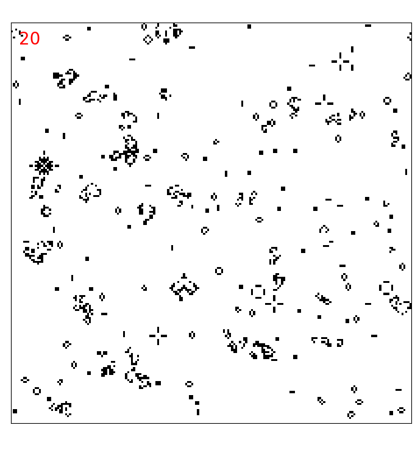

# Conway's Game of Life

### Simple implementation of [Conway's example](https://en.wikipedia.org/wiki/Conway%27s_Game_of_Life) of a [cellular automaton](https://en.wikipedia.org/wiki/Cellular_automaton).

#### We use here an hybrid method, combining Python on the frontend and C on the backend. This allows easy visualization through [matplotlib](https://matplotlib.org/) with enough performance to generate lattices of linear sizes ~ 5000. Square domains with periodic boundary conditions are in use.

##### To compile the c file to a library use:
```bash
gcc -fPIC -c gameoflife_evolve.c
gcc gameoflife_evolve.o -shared -o gameoflife_evolve.so
```


